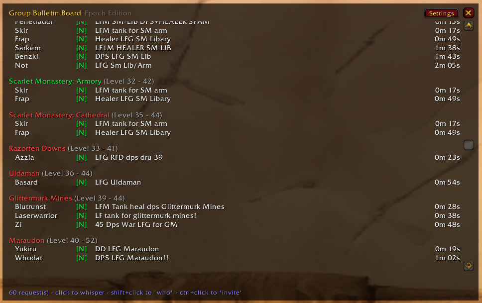
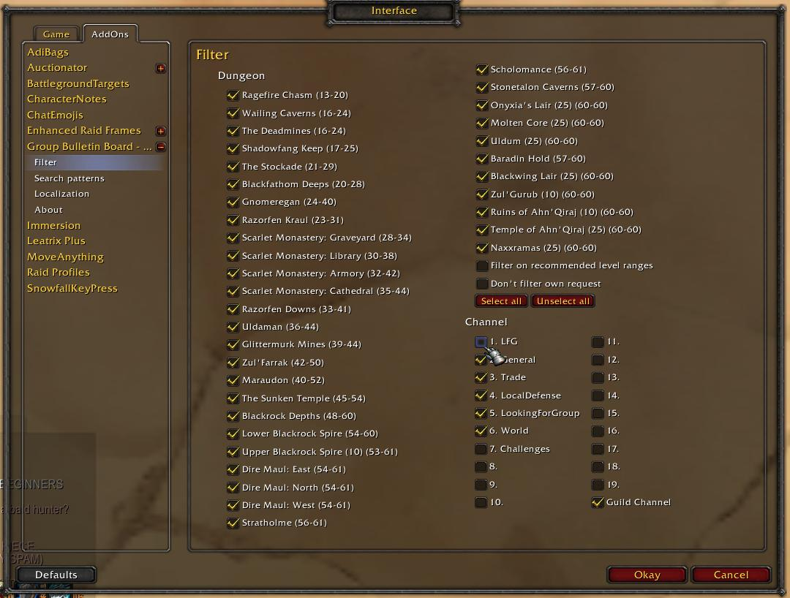

# GroupBulletinBoard-Epoch

This is an adaptation for [Project Epoch](https://www.project-epoch.net) of a port to WotLK (3.3.5a) of a TBC backport of a Classic TBC addon!

* Project Epoch (3.3.5a) [sogladev](https://github.com/sogladev)
* WotLK (3.3.5a) port: [fondlez](https://github.com/fondlez)
* TBC 2.4.3 backport: [Obszczymucha aka. Ohhaimark](https://codeberg.org/obszczymucha/group-bulletin-board-tbc)
* Classic TBC addon: [Vyscî-Whitemane](https://github.com/Vysci/LFG-Bulletin-Board)
* Original addon: https://legacy.curseforge.com/wow/addons/group-bulletin-board

⚠️ When using [LFG Addon](https://github.com/Bennylavaa/LFG) disable the "LFG" channel (see Interface section below) if you do not wish to see `LFG:smlib:damage` entries.

## Description
GroupBulletinBoard (GBB) provides an overview of the endless requests in the 
chat channels. It detects all requests to the instances, sorts them and presents 
them clearly way. Numerous filtering options reduce the gigantic number to 
exactly the dungeons that interest you. And if that's not enough, GBB will let 
you know about any new request via a sound or chat notification.

Currently, English, German, Russian and Chinese dungeons are recognized 
natively. But it is easily possible to adapt GBB to any language.

To open the settings, use slash command: **`/gbb`** or click the minimap icon.

## Graphical Interface

### Main Window

### Interface Settings

## Slash Commands

`<value>` can be true, 1, enable, false, 0, disable. If <value> is omitted, the 
current status switches.

* `/gbb notify chat <value>` - On new request make a chat notification
* `/gbb notify sound <value>` - On new request make a sound notification
* `/gbb debug <value>` - Show debug information
* `/gbb reset` -  Reset main window position
* `/gbb config/setup/options` - Open configuration
* `/gbb about` - open about
* `/gbb help` - Print help
* `/gbb chat clean/organize` - Creates a new chat tab if one doesn't already 
exist, named \"LFG\" with all channels subscribed. Removes LFG heavy spam 
channels from default chat tab
* `/gbb` - open main window

## Credits

### Original Addon
* Arrogant_Dreamer, Hubbotu and kavarus for the Russian translation
* Baudzilla for the graphics/idea of the resize-code